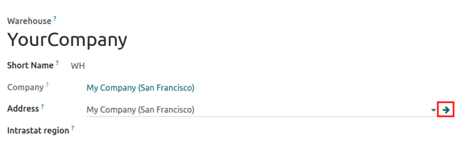
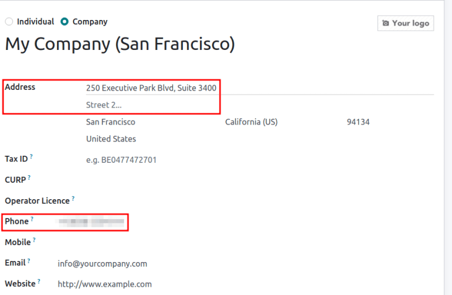

==============================
Integrate third-party carriers
==============================

.. _inventory/shipping/third_party:

Link third-party shipping carriers to Odoo databases to verify carriers' delivery to specific
addresses, :doc:`automatically calculate shipping costs <delivery_method>`, and :doc:`generate
shipping labels <../advanced_operations_shipping/labels>`.

.. seealso::
   - :doc:`dhl_credentials`
   - :doc:`sendcloud_shipping`
   - :doc:`ups_credentials`

The following is a list of available shipping connectors in Odoo:

.. list-table::
   :header-rows: 1
   :stub-columns: 1

   * - Carrier
     - Region availability
   * - FedEx
     - All
   * - :doc:`DHL <dhl_credentials>`
     - All
   * - :doc:`UPS <ups_credentials>`
     - All
   * - US Postal Service
     - Unites States of America
   * - :doc:`Sendcloud <sendcloud_shipping>`
     - EU
   * - Bpost
     - Belgium
   * - Easypost
     - North America
   * - Shiprocket
     - India

Configuration
=============

Install shipping connector
--------------------------

To install shipping connectors, go to :menuselection:`Inventory app --> Configuration --> Settings`.

Under the :guilabel:`Shipping Connectors` section, select the third-party shipping carrier's
checkbox to install it.

.. image:: third_party_shipper/shipping-connectors.png
   :align: center
   :alt: Options of available shipping connectors in Odoo.

Then, click :guilabel:`Save`.

.. note::
   :doc:`Delivery methods <delivery_method>` can also be integrated with operations in the *Sales*,
   *eCommerce*, and *Website* apps. (installation details found :ref:`here <general/install>`).

.. _inventory/shipping_receiving/configure-delivery-method:

Delivery method
---------------

To configure the API credentials and activate the shipping carrier, begin by going to
:menuselection:`Inventory app --> Configuration --> Shipping Methods`, and select the desired
delivery method.

.. note::
   The list often includes **two** delivery methods from the same :guilabel:`Provider`: one for
   international shipping and one for domestic shipping.

   Additional delivery methods can be created for specific purposes, such as :doc:`packaging
   <../../product_management/product_tracking/packaging>`.

.. seealso::
   :doc:`Configure delivery methods <delivery_method>`

.. note::
   Ensure the delivery method :guilabel:`Is Published` when it should be available on the *Website*
   app. To publish a delivery method on the website, click the desired delivery method and click the
   :guilabel:`Unpublished` smart button.

   .. image:: third_party_shipper/publish-delivery-method.png
      :align: center
      :alt: Display list of delivery methods and the "is Published" column.

On the :guilabel:`Shipping Method` page, configure the :doc:`delivery method details
<../setup_configuration/delivery_method>`, such as :guilabel:`Delivery Product` and
:guilabel:`Invoicing Policy`.

Then, input the API credentials and password with the shipping carrier in the
:guilabel:`Configuration` tab. Then, go to the :guilabel:`Destination Availability` tab and
configure the service coverage of the shipping carrier. For specific details about configuring
shipping method credentials, refer to the following documents:

.. seealso::
   - :doc:`DHL credentials <dhl_credentials>`
   - :doc:`Sendcloud credentials <sendcloud_shipping>`
   - :doc:`UPS credentials <ups_credentials>`

Publish
~~~~~~~

With the delivery method details configured, click the :guilabel:`Test Environment` smart button to
activate it.

.. warning::
   Setting the delivery method to :guilabel:`Production` creates **real** shipping labels, and users
   are at risk for being charged through their carrier account (e.g. UPS, FedEx), **before** users
   charge customers for shipping. Verify all configurations are correct before launching the
   delivery method to :guilabel:`Production`.

.. image:: third_party_shipper/production.png
   :align: center
   :alt: Show the "Test Environment" smart button.

.. _inventory/shipping_receiving/configure-source-address:

Source address
--------------

Configure the source address for package shipments by navigating to :menuselection:`Inventory app
--> Configuration --> Warehouses` and selecting the desired warehouse.

On the warehouse configuration page, hover over the :guilabel:`Address` field and select the
:guilabel:`➡️ (right arrow)` icon. Doing so opens the warehouse contact page.

Ensure the warehouse's :guilabel:`Address` and :guilabel:`Phone` number are entered accurately, as
they are used to calculate cost of shipping.

.. _inventory/shipping_receiving/configure-weight:

Product weight
--------------

To calculate the price of shipping, specify the weight of products by going to
:menuselection:`Inventory app --> Products --> Products`, and selecting the desired product.

Then, switch to the :guilabel:`Inventory` tab, and define the :guilabel:`Weight` of the product, in
kilograms.

.. image:: third_party_shipper/product-weight.png
   :align: center
   :alt: Display the "Weight" field in the Inventory tab of the product form.

.. tip::
   Make sure to convert weights into kilograms for the calculations to work properly.

Apply third-party shipping carrier on sales order
=================================================

After configuring the third-party carrier's :ref:`delivery method
<inventory/shipping_receiving/configure-delivery-method>` in Odoo, create or navigate to a quotation
by going to :menuselection:`Sales app --> Orders --> Quotations`.

Add shipping
------------

Add the cost of shipping through a third-party carrier to a quotation by clicking the :guilabel:`Add
Shipping` button in the bottom-right corner.

.. image:: ../advanced_operations_shipping/invoicing/add-shipping.png
   :align: center
   :alt: Show the "Add shipping" button at the bottom of a quotation.

In the resulting pop-up window, select the intended carrier from the :guilabel:`Shipping Method`
drop-down menu. The :guilabel:`Cost` field is automatically filled based on the :ref:`product weight
<inventory/shipping_receiving/configure-weight>` and distance between the warehouse's :ref:`source
address <inventory/shipping_receiving/configure-source-address>` and the customer address.

Click :guilabel:`Get Rate` to add the cost to the quotation, which is listed as the delivery product
configured earlier.

.. image:: ../advanced_operations_shipping/invoicing/add-a-shipping-method.png
   :align: center
   :alt: Show the "Get rate" button in the "Add a shipping method" pop-up.

.. seealso::
   :doc:`Charge customers for shipping after product delivery
   <../advanced_operations_shipping/invoicing>`

Delivery information
--------------------

After confirming the sales order, click the :guilabel:`Delivery` smart button to view the linked
delivery order.

In the :guilabel:`Additional info` tab, the third-party shipping carrier is listed in the
:guilabel:`Carrier` field. When the delivery method is set to :ref:`production mode
<inventory/shipping_receiving/configure-delivery-method>`, a :guilabel:`Tracking Reference` is
provided.

.. seealso::
   :doc:`Generate shipping labels <../advanced_operations_shipping/labels>`

.. image:: third_party_shipper/delivery-info.png
   :align: center
   :alt: Show the delivery order's "Additional info" tab.
