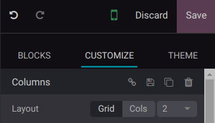
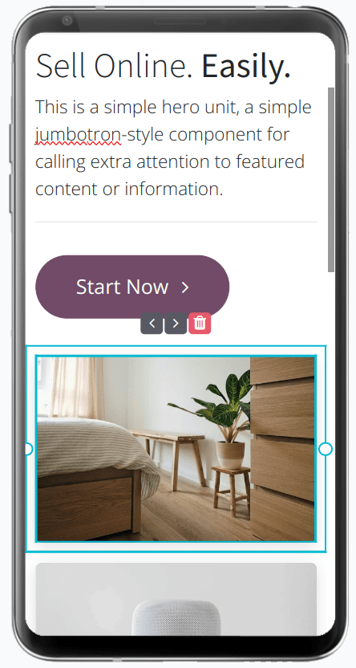

==============
Responsiveness
==============

Ensuring your website's responsiveness on various devices such as computers, tablets, or smartphones
provides users with a seamless browsing experience and boosts your website's :doc:`SEO <seo>`.

Odoo's website builder allows you to create a responsive design that adapts automatically to
different screen sizes and to customize your website's mobile version.

.. seealso::
   :doc:`building blocks <../web_design/building_blocks>`

Mobile view customization
=========================

To tailor the mobile view of your website, you can edit the :guilabel:`Cols` and
:guilabel:`Visibility` features. To do so, click the mobile icon at the top of the website editor,
select an element of your building block, and go to the :guilabel:`Customize` tab.

:guilabel:`Cols`: The :guilabel:`Cols` layout allows you to determine the number of elements per
line within the block. By default, only one element per column is used on mobile devices. You can
adjust this value by switching to the :guilabel:`Mobile Preview` mode, clicking the block you want
to modify, selecting the :guilabel:`Cols` :guilabel:`Layout`, and adjusting the number - all without
any impact on the desktop view.

:guilabel:`Visibility`: You can :ref:`hide <building_blocks/visibility>` specific elements of your
website depending on the visitor’s device and change the order of the elements of a block on mobile
without affecting the desktop view. Select an element of your building block and click the
left/right arrow icon to reorder the elements.

