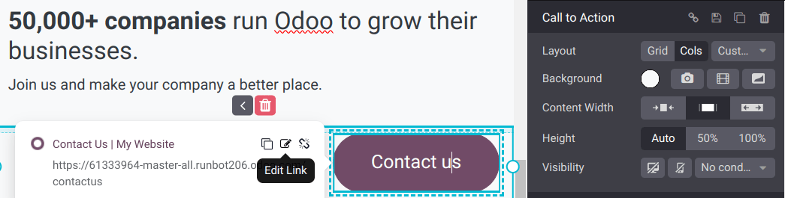

===============
Features blocks
===============

Use the :guilabel:`Features` :doc:`building blocks <../building_blocks>` to enhance your website
with advanced functionalities, such as product or service attributes. The blocks from this category,
such as the :ref:`Table of content <features_blocks/table_of_content>` or the :ref:`Call to action
<features_blocks/call_to_action>`, allow you to display the content of your website in an
illustrative manner rather than sticking to the textual content.

.. image:: features_blocks/features_blocks.png
   :alt: The features blocks available in the website builder.

.. _features_blocks/table_of_content:

Table of content
================

You can add the :guilabel:`Table of content` building block to your website by dragging and dropping
it from the :guilabel:`Features` blocks section in the website configurator. Then, you can customize
the appearance and functionality of the table of contents from the :guilabel:`Customize` tab.

.. note::
   :guilabel:`Header 2` titles automatically appear on the left of your page, helping users navigate
   your content.

.. image:: features_blocks/table_of_content.png
   :alt: Displaying the table of content building block.

.. _features_blocks/call_to_action:

Call to action
==============

Use the :guilabel:`Call to Action` building block to prompt visitors to take a specific action, such
as purchasing, signing up for a newsletter, or contacting your company.

To customize the appearance of your :guilabel:`Call to Action` button, click on it and go to the
:guilabel:`Call to Action` section.

In the :guilabel:`Inline Text` section, click the :guilabel:`Insert media` icon to allow visitors to
download an image, a document, an icon, or a video, when clicking the button. You can also set up an
external address or another page of your site, such as your /shop or your /contactus page.

